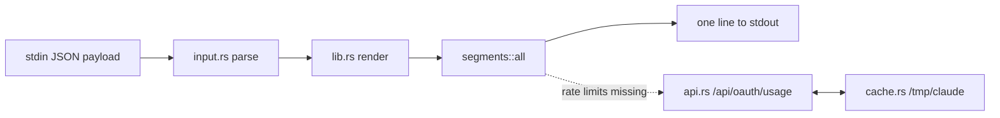

# Architecture

Around 500 lines of Rust: a library plus a thin binary. `main.rs` reads the Claude
Code statusline JSON payload from stdin, hands it to `render()`, and prints the one
line that comes back. Every segment is independent and failure-tolerant - anything
that cannot be determined is dropped from the line rather than erroring out.

## Layout

| File                        | What lives there                                        |
|-----------------------------|---------------------------------------------------------|
| src/main.rs                 | Reads stdin, calls `render`, prints                     |
| src/lib.rs                  | `render()` orchestrator and module re-exports           |
| src/input.rs                | Serde input types for the Claude statusline payload     |
| src/error.rs                | Hand-rolled `Error` enum + `Result` alias               |
| src/bar.rs                  | Braille progress bar                                    |
| src/cache.rs                | On-disk JSON cache under /tmp/claude/                   |
| src/api.rs                  | `/api/oauth/usage` fetcher                              |
| src/time.rs                 | Epoch + ISO datetime helpers                            |
| src/segments/mod.rs         | `all(&Input)` flat dispatcher                           |
| src/segments/model.rs       | Model name segment                                      |
| src/segments/project.rs     | Project name segment + generic-subfolder list           |
| src/segments/git.rs         | Git branch + numstat segment                            |
| src/segments/tokens.rs      | Token bar segment                                       |
| src/segments/effort.rs      | Effort level segment                                    |
| src/segments/rate_limits.rs | Rate-limit segments (builtin + API path)                |
| tests/render.rs             | Integration test feeding fixture payloads to `render()` |

## Decisions

These are settled. They are written down so they do not get relitigated every time
someone new reads the code.

### No `Segment` trait

The dispatcher in `src/segments/mod.rs` is a flat function that hand-lists each
segment in render order. Five segments do not benefit from a trait registry:

- The order matters and is easier to read as a `Vec::push` sequence than as a list
  of trait implementations.
- Segments return different shapes - `String`, `Option<String>`, `Vec<String>` -
  forcing them through one method signature would lose information.
- A trait registry would invite "dynamic registration", "feature flags per
  segment", and other features that the binary does not need.

If the segment count grows past ~10 or segments start needing shared lifecycle
hooks, revisit. Until then: flat dispatcher.

### Hand-rolled `Error` enum

`anyhow` and `thiserror` are both fine crates, but this binary has roughly five
error sites and the user-facing behaviour is "print something or print 'Claude'" -
errors collapse to a fallback at the top level. They never reach output.

`src/error.rs` is 40 lines and avoids two dependencies. If error handling ever
escapes the binary boundary (a published `lib.rs` API consumed by another crate,
say), revisit.

### A high bar for dependencies

The current set is `serde`, `serde_json`, `chrono`, `ureq`, plus
`pretty_assertions` for tests. Each addition pays compile time, audit surface, and
release-binary size forever. See [contributing](contributing.md#adding-a-dependency)
for what a PR that adds one has to answer.
